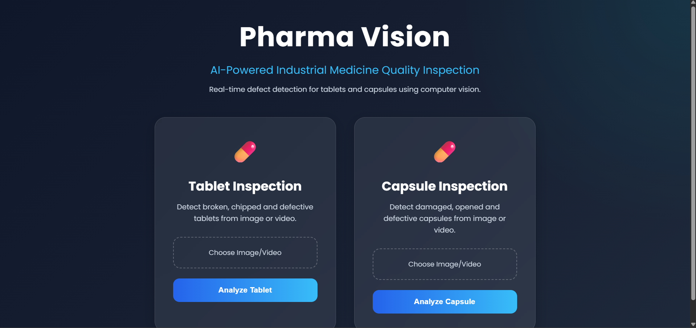
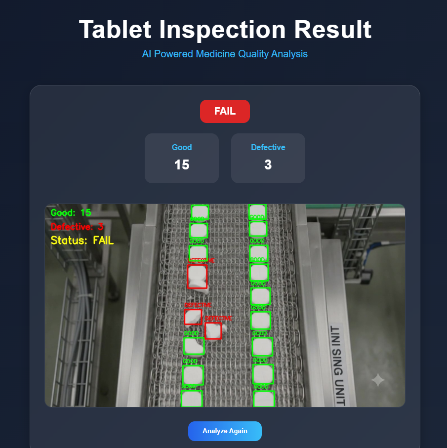
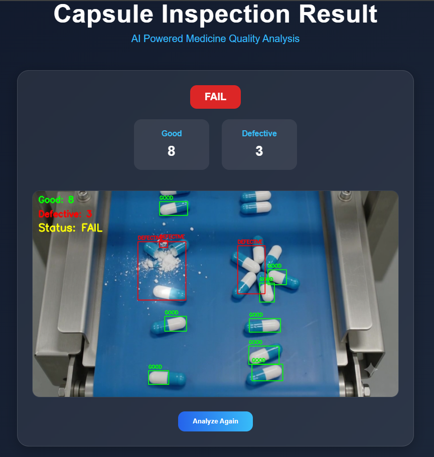

# Pharma Vision – AI-Based Tablet & Capsule Inspection System

Pharma Vision is a computer vision-based medicine inspection system developed to detect defective tablets and capsules during conveyor belt movement.

The goal of this project is to automate medicine quality inspection in pharmaceutical manufacturing by identifying damaged medicines such as broken tablets and open/broken capsules.

The system supports both **image and video inspection** through a simple **Flask-based web interface**, where users can upload medicine images or conveyor videos and get inspection results with defect detection, counts, and PASS/FAIL status.

---

## Features

- Tablet defect detection using shape analysis
- Capsule defect detection for broken/open capsules
- Conveyor belt video inspection support
- Image and video upload support
- Bounding box visualization
- PASS/FAIL inspection status
- Flask-based web interface

---

## Project Preview

### Home Page



### Tablet Inspection Result



### Capsule Inspection Result



---

## Tech Stack

- Python
- OpenCV
- NumPy
- Flask
- Computer Vision

---

## Project Structure

```text
Pharma-Vision/
│── app.py
│
├── tablet/
│   └── tablet_processor.py
│
├── capsule/
│   └── capsule_processor.py
│
├── templates/
│   ├── index.html
│   └── result.html
│
├── static/
│   ├── style.css
│   ├── uploads/
│   └── outputs/
│
├── assets/
│   ├── home_page.png
│   ├── tablet_result.png
│   └── capsule_result.png
│
├── requirements.txt
│
└── README.md
````

---

## Installation

### 1. Clone Repository

```bash
git clone https://github.com/rajchouhan19/Pharma-Vision.git
```

### 2. Move to Project Folder

```bash
cd Pharma-Vision
```

### 3. Install Dependencies

```bash
pip install -r requirements.txt
```

### 4. Run Application

```bash
python app.py
```

### 5. Open Browser

```text
http://127.0.0.1:5000
```

---

## Future Improvements

* Deep Learning based defect detection (YOLO)
* Real-time camera inspection
* Better defect classification
* Production-scale conveyor integration

---

## Author

**Raj Narayan Singh Chouhan**

